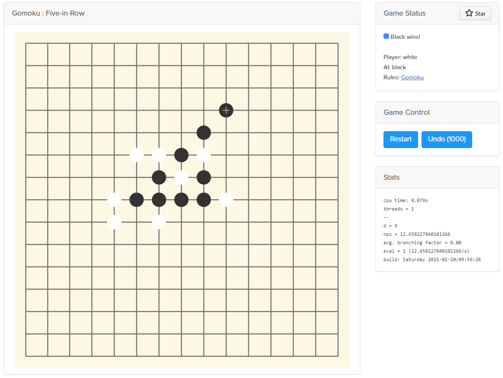

# gomoku

[](https://travis-ci.com/chenyukang/gomoku)

A Gomoku backend to explore minimax algorithm with alpha-beta tunning.

# Usage

```sh
cd algo
cargo build --release
./target/release/gomoku -s  //start server listen to http://localhost:3000

cd client // open index.html in browser and have fun.
```

# Demo 

[http://138.91.229.77/](http://138.91.229.77/)

